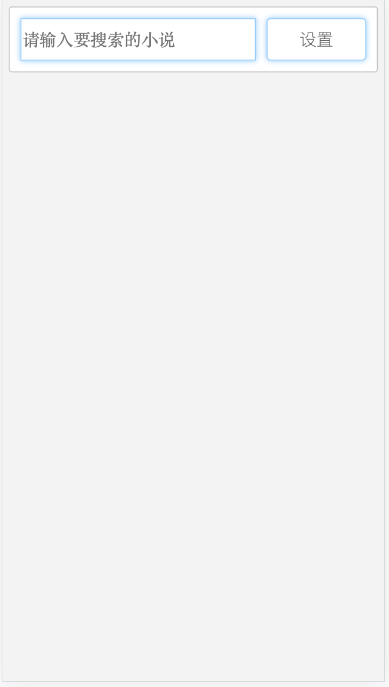
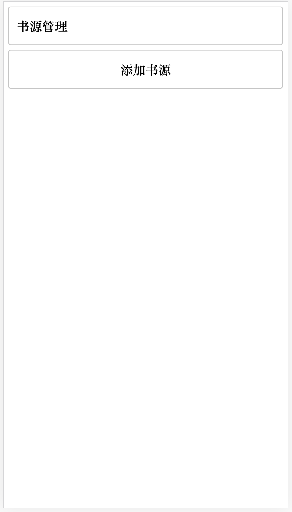
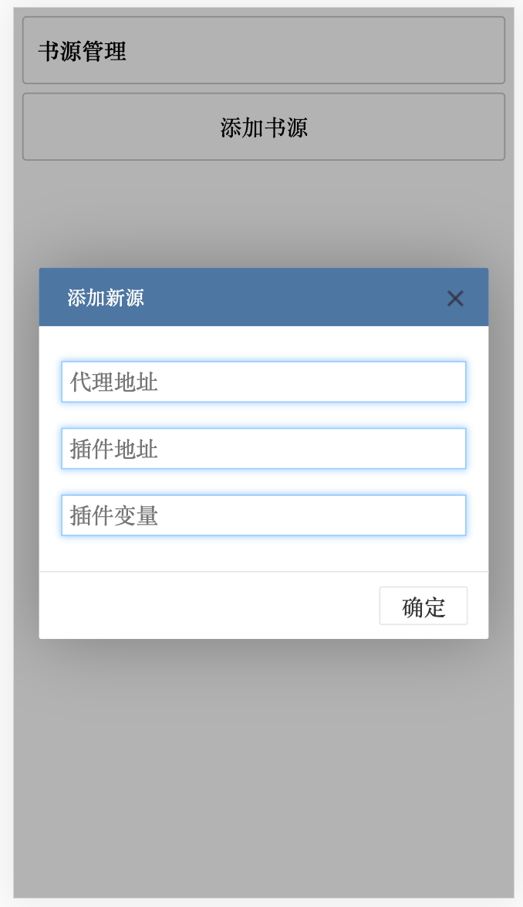
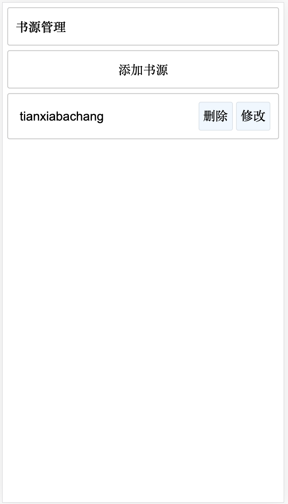
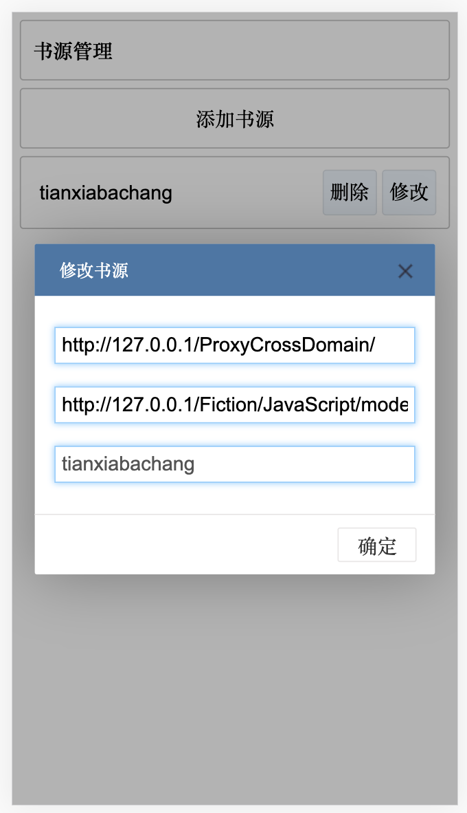
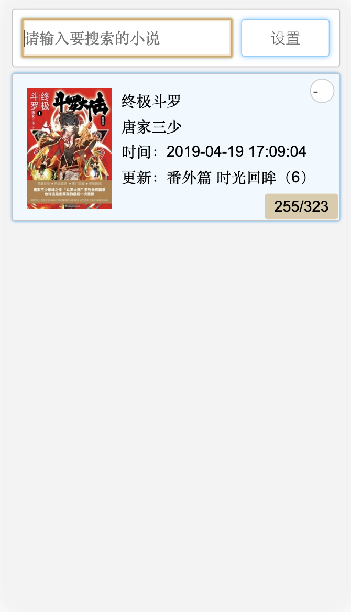
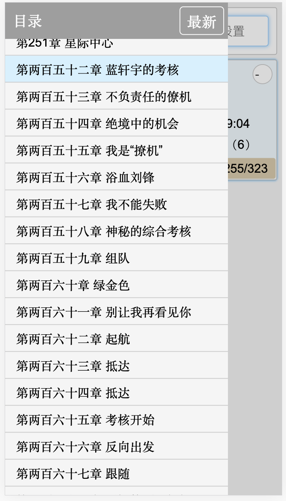
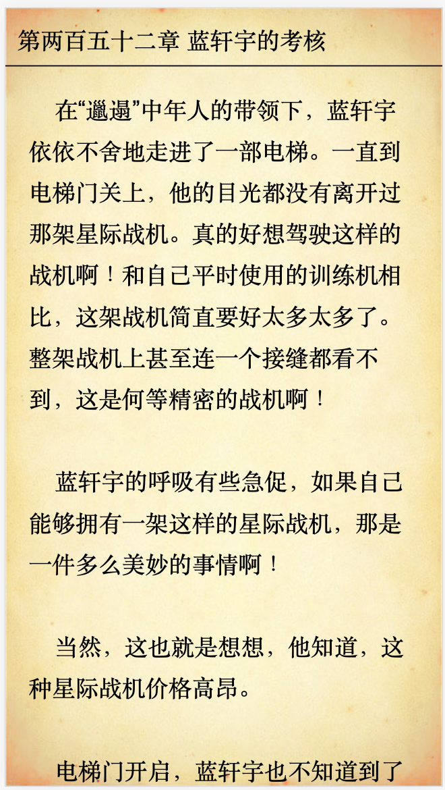
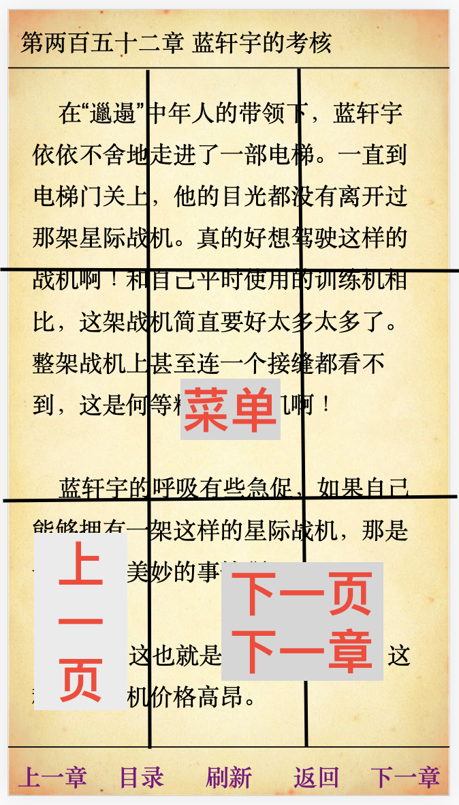

# 使用说明

## 功能介绍

1. 默认界面

  

1. 添加书源

  <div style="display:flex;">
    
    
    
    
  </div>

1. 搜索，使用

<div style="display:flex;">
  
  
  
  
</div>


## 开发书源

### 开发说明

#### API 接口

1. API.GetData

  > ```javascript
  > /** GET 请求
  >  * url 请求网址
  >  * callback 成功回调
  >  * err 出错回调
  >  */
  > function (url, callback, err){}
  > ```

1. API.PutData

  > ```javascript
  > /** POST 请求
  >  * url 请求网址
  >  * data 请求数据
  >  * callback 成功回调
  >  * err 出错回调
  >  */
  > function (url, data, callback, err){}
  > ```

1. API.PutJson

  > ```javascript
  > /** POST 发送 JSON 请求
  >  * url 请求网址
  >  * data 请求数据
  >  * callback 成功回调
  >  * err 出错回调
  >  */
  > function (url, data, callback, err){}
  > ```

1. API.GBKencodeURI

  > ```javascript
  > /** GBK URL 转义
  >  * str 待转吗
  >  */
  > function (str){}
  > ```


#### 扩展接口

1. `String.prototype.format`

   可使用占位符字符替换，举个🌰：

   ```javascript
   "{data}".format({data:"数据"})
   ```

   ```javascript
   "{0}{1}".format("数据1","数据2")
   ```
   
2. `String.prototype.toDate`

   可以将日期型字符串快速转换为日期对象，举个🌰：

   ```javascript
   "2019-04-01 12:12:12".toDate()
   ```

3. `Date.prototype.format`

   可以将日期转换为指定格式日期型字符串，举个🌰：

   ```javascript
   (new Date().format("yyyy-MM-dd hh:mm:ss")
   ```

   ```javascript
   (new Date().format("yyyy-MM+8-dd hh:mm:s")
   ```

4. `Date.prototype.Add`
  举个🌰：见：  `Date.prototype.format` 🌰
  
#### 书源对象

以下是必须属性，用于基本操作

1. `mode` 对象名
1. `title` 别名
1. `url` 地址
1. `ProxyUrl` 代理地址
1. `search` `function(keyword)` 搜索
1. `catalog` `function(bookUrl)` 获取目录
1. `content` `function(catalog)` 获取内容
1. `update` `function(book)` 检查更新


### 举个例子🌰

```javascript
if (!window.书源变量)
    window.书源变量 = {
        mode: "书源变量",
        title:"书源标题",
        url: "书源网址",
        ProxyUrl: "代理地址",
        search: function (keyword) { // 搜索功能
            let self = this;
            return new Promise((resolve, reject) => { // 使用 Promise
              	// 调用 提供的 PutData 借口，发送键值对 POST 请求
                API.PutData(`${self.url}/SearchBook.php`,{q:keyword}, function (data) {
                    if (data.Code === 0) { // 请求成功
                      	// 创建虚拟节点，渲染内容
                        let documentFragment = document.createDocumentFragment();
                        let box = document.createElement("div");
                      	// 去掉图片，避免渲染
                        data.Result = data.Result.replace(/]*)>/g, "<img1$1>");
                      	// 去掉JavaScript，避免污染
                        data.Result = data.Result.replace(/<script([^>]*)>/g, "<script1$1>");
                        // 去掉 link，避免污染
                        data.Result = data.Result.replace(/<link([^>]*)>/g, "<link1$1>");
                        // 放入容器
                        box.innerHTML = data.Result;
                        // 加入到虚拟节点，渲染内容
                        documentFragment.appendChild(box);
                        // 获取图书列表：当前例子🌰为 .hot_sale
                        let list = box.querySelectorAll(".hot_sale");
                        let da = [];
                        for (let i in list) {
                            if (list.hasOwnProperty(i)) {
                                let dom = list[i];
                                let _ = dom.querySelectorAll(".author");
                                let bookUrl = dom.querySelector("a").getAttribute("href");
                                let _bookUrl = bookUrl.replace(/^\/?([^\/]*)\/?$/g, "$1");
                                da.push({
                                    title: dom.querySelector(".title").innerText.replace(/\n/g, ''),// 书名
                                    catalog: [],// 目录
                                    CatalogIndex: -1,// 已读章节
                                    mode: self.mode,// 书源，默认使用当前对象 mode
                                    data: {
                                        url: bookUrl,// 书地址
                                        title: dom.querySelector(".title").innerText.replace(/\n/g, ''),// 书名
                                        author: _[0].innerText.replace(/\n/g, ''),// 作者
                                        state: _[1].innerText.replace(/\n/g, ''),// 状态
                                        image: "",// 封面 ： 当前🌰无封面，如果有，则填入
                                    }
                                });
                            }
                        }
                        resolve(da);// 返回给调用接口
                    } else {
                        reject(data.Message);
                    }
                }, function (errmess) {
                    reject(errmess);
                });
            });
        },
        catalog: function (bookUrl) { //  获取目录列表
            let self = this;
            return new Promise((resolve, reject) => { // 使用 Promise
                // 当前🌰使用 POST ，部分书源需要使用 GET，即 API.GetData
                API.PutData(`${self.url}${bookUrl}/all.html`, {},function (data) {
                    if (data.Code === 0) {
                        let documentFragment = document.createDocumentFragment();
                        let box = document.createElement("div");
                        data.Result = data.Result.replace(/]*)>/g, "<img1$1>");
                        data.Result = data.Result.replace(/<script([^>]*)>/g, "<script1$1>");
                        data.Result = data.Result.replace(/<link([^>]*)>/g, "<link1$1>");
                        box.innerHTML = data.Result;
                        documentFragment.appendChild(box);
                        // 获取章节列表
                        let list = box.querySelectorAll("#chapterlist > p a");
                        let da = [];
                        for (let i in list) {
                            if (list.hasOwnProperty(i)) {
                                let dom = list[i];
                                let bookUrl = dom.getAttribute("href");
                                let title = dom.innerText;
                                if (title.indexOf("直达页面底部") !== -1) continue;
                                da.push({
                                    url: bookUrl,// 章节地址
                                    title: title,// 章节名
                                });
                            }
                        }
                        resolve(da);
                    } else {
                        reject(data.Message);
                    }
                }, function (errmess) {
                    reject(errmess);
                });
            });
        },
        content: function (catalog) { //  获取章节内容
            let self = this;
            return new Promise((resolve, reject) => {
                API.PutData(`${self.url}${catalog.url}`,{}, async function (data) {
                    if (data.Code === 0) {
                        let documentFragment = document.createDocumentFragment();
                        let box = document.createElement("div");
                        // 去掉连续换行
                        data.Result = data.Result.replace(/<br\/><br\/>/g, "<br/>");
                        data.Result = data.Result.replace(/]*)>/g, "<img1$1>");
                        data.Result = data.Result.replace(/<script([^>]*)>/g, "<script1$1>");
                        data.Result = data.Result.replace(/<link([^>]*)>/g, "<link1$1>");
                        box.innerHTML = data.Result;
                        documentFragment.appendChild(box);
                        let chaptercontent = box.querySelector("#chaptercontent");
                        // 是否采用分页
                        let pb_next = box.querySelector("#pb_next");
                        try {
                            // 去掉广告
                            chaptercontent.removeChild(chaptercontent.querySelector("div"));
                            // 去掉广告
                            chaptercontent.removeChild(chaptercontent.querySelector("p"));
                        } catch (e) {

                        }
                        let da = chaptercontent.innerHTML;
                        // 如果分页，则需要获取下一页内容
                        if (pb_next !== null && pb_next.innerText.indexOf("页") !== -1) {
                            let _ = {
                                title:catalog.title,// 章节名
                                url:`${catalog.url.split('/').slice(0, -1).join('/')}/${pb_next.getAttribute("href")}`// 下一页地址
                            };
                            // 添加到当前内容之后
                            da += await self.content(_)
                        }
                        resolve(da);
                    } else {
                        reject(data.Message);
                    }
                }, function (errmess) {
                    reject(errmess);
                });
            });
        },
        update: function (book) { // 检查图书更新
            let self = this;
            return new Promise((resolve, reject) => {
                API.PutData(`${self.url}${book.url}`,{}, function (data) {
                    if (data.Code === 0) {
                        let documentFragment = document.createDocumentFragment();
                        let box = document.createElement("div");
                        data.Result = data.Result.replace(/<br\/><br\/>/g, "<br/>");
                        data.Result = data.Result.replace(/]*)>/g, "<img1$1>");
                        data.Result = data.Result.replace(/<script([^>]*)>/g, "<script1$1>");
                        data.Result = data.Result.replace(/<link([^>]*)>/g, "<link1$1>");
                        box.innerHTML = data.Result;
                        documentFragment.appendChild(box);
                        let synopsisArea_detail = box.querySelector(".synopsisArea_detail");
                        try {
                            book.image = synopsisArea_detail.querySelector("img1").getAttribute("src");// 获取图书封面
                            book.state = synopsisArea_detail.querySelectorAll("p")[4].innerText.replace(/\n/g, '').trim(); // 获取图书状态
                            book.time = synopsisArea_detail.querySelectorAll("p")[3].innerText.replace(/\n/g, '').trim(); // 获取图书时间
                        } catch (e) {
                            console.log(e);
                        }
                        resolve(book);
                    } else {
                        reject(data.Message);
                    }
                }, function (errmess) {
                    reject(errmess);
                });
            });
        }
    };
```

